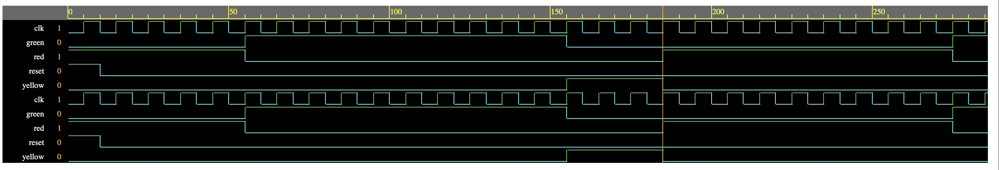

# Traffic Light + Pedestrian Controller

## Project Overview

This project implements a digital traffic light controller with pedestrian crossing control using Verilog HDL.

The controller manages three traffic light states:

- RED
- GREEN
- YELLOW

A pedestrian request is handled by the controller and provides:

- WALK signal
- DON'T WALK signal
- Pedestrian countdown

The design is implemented as a finite state machine (FSM) with a counter-based timing mechanism.

## Features

- Synchronous traffic light sequencing
- Asynchronous active-high reset
- Pedestrian button input
- Pedestrian crossing control
- WALK / DON'T WALK indication
- Pedestrian countdown
- Parameterized traffic light timing
- Self-checking testbench
- Simulation waveform verification

## FSM States

| State | Traffic Light | Pedestrian |
|---|---|---|
| RED | Red ON | DON'T WALK |
| GREEN | Green ON | DON'T WALK |
| YELLOW | Yellow ON | DON'T WALK |
| PEDESTRIAN | Red ON | WALK |

## Timing

The traffic light timing is controlled using a counter.

The design uses separate timing parameters for:

- Red light
- Green light
- Yellow light
- Pedestrian crossing

## Inputs

| Signal | Description |
|---|---|
| `clk` | System clock |
| `reset` | Active-high reset |
| `ped_button` | Pedestrian crossing request |

## Outputs

| Signal | Description |
|---|---|
| `red` | Traffic red light |
| `yellow` | Traffic yellow light |
| `green` | Traffic green light |
| `ped_walk` | Pedestrian WALK indication |
| `ped_dont_walk` | Pedestrian DON'T WALK indication |
| `ped_counter` | Pedestrian countdown |

## Verification

The RTL was simulated using:

- Simulator: Icarus Verilog
- Environment: EDA Playground
- Waveform Viewer: EPWave

### Verification Result

**ALL TESTS PASSED**

The testbench verifies normal traffic light operation and pedestrian crossing behavior.

## Waveform



## Project Structure

```text
03_Traffic_Light_Pedestrian_Controller/
├── design.sv
├── testbench.sv
├── waveform.jpeg
├── verification_results.txt
└── README.md
